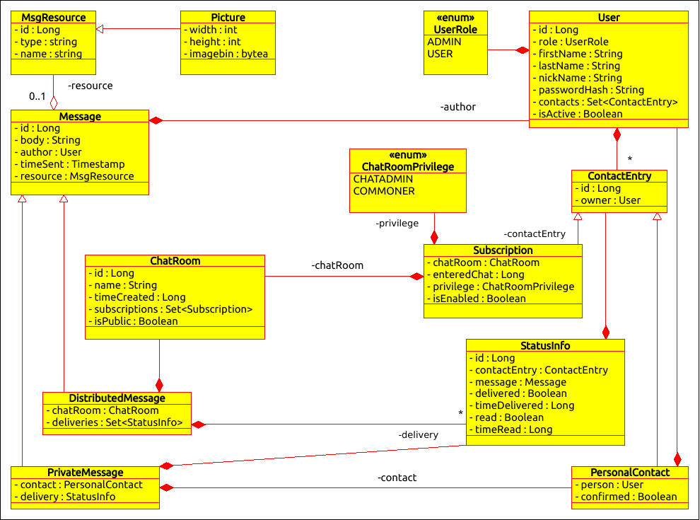
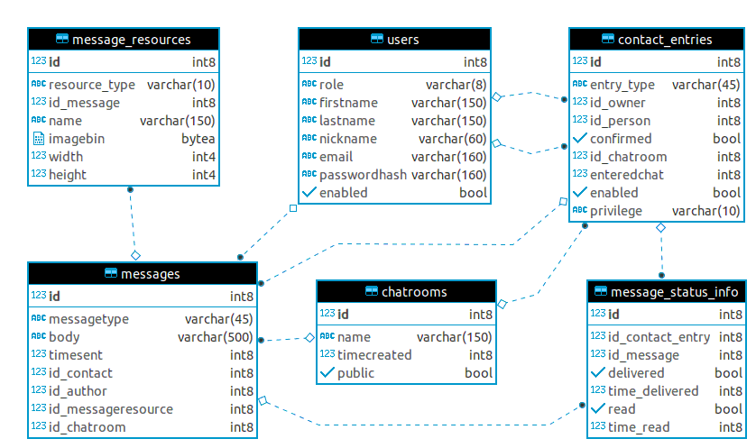

# instant-messenger-webapp-trainig
***
persistence layer (module)

exports repositories and domain model classes (+ search utilities: static jpametamodel)

to compile and run the app (tests are broken by the build (so they are skipped) - but will be fixed soon...):
mvn -D env=local clean package

***
**UML - entities (user domain is a bit different and slightly extended):**
***

***
**DB schema (discard the user domain in the schema):**
***
